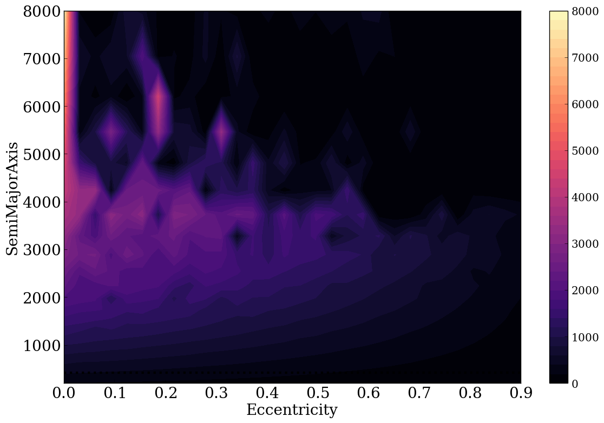
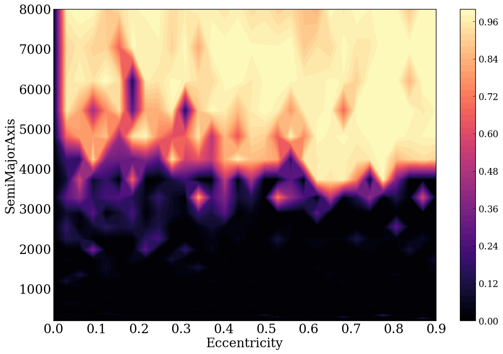

Evolution of a Wide Stellar Binary due to Galactic Effects
================

Overview
--------

Orbital evolution of 40EriABC system due to galactic migration,
the galactic tide, and passing field stars.

===================   ============
**Date**              06/13/19
**Author**            Ningyi Chen
**Modules**           GalHabit
**Approx. runtime**   12 hours
===================   ============

Wide orbits are subject to torques from the galactic tide, as well as impulses from
passing stars. Complicating the evolution is the possibility of migration, in which
stars can migrate multiple kpc from their birth location. This example shows that
evolution for an M dwarf orbiting a Sun-like star.

To run this example
-------------------

.. code-block:: bash

    # Run 
    vspace vspace.in

    # Plot the figure (contour plot of pericenter values)
    python makeplot.py <pdf | png>

    # Plot the figure (contour plot of ratio of change in pericenter values)
    python plotratio.py <pdf | png>

Expected output
---------------

   
   GalaxyEffects.png:
   Evolution of 40EriBC orbiting the 40EriA under the influence of the galactic
   environment. 
   

   
   PeriqRatio.png:
   Contour plot of ratio of change in pericenter to initial pericenter value.
   
