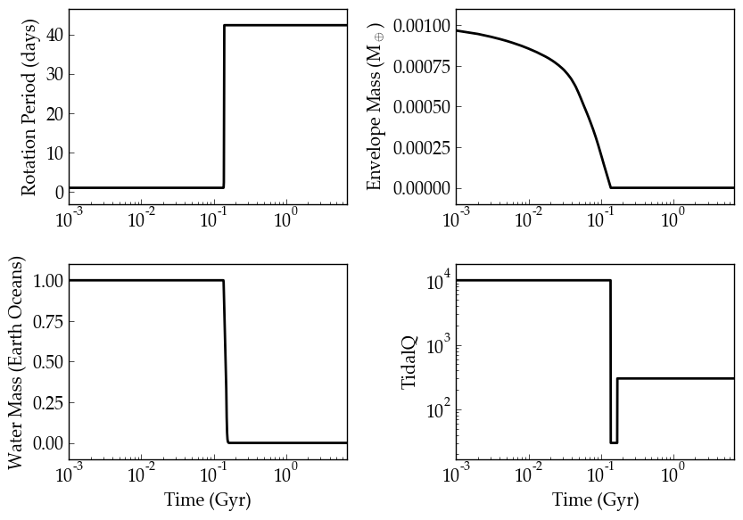

40 Eridani
==============

Overview
--------

===================   ============
**Date**              09/30/2018
**Author**            Rory Barnes
**Modules**           eqtide
                      stellar
                      atmesc
                      galhabit
**Approx. runtime**   16 seconds
**Source code**       `vplanet <https://github.com/VirtualPlanetaryLaboratory/vplanet/>`_
===================   ============

Possible evolutionary history of 40 Eridani A b (aka Vulcan).

To run this example
-------------------

.. code-block:: bash

    vplanet vpl.in
    python makeplot.py <pdf | png>

Expected output
---------------

Evolution of 40 Eridani A b.
